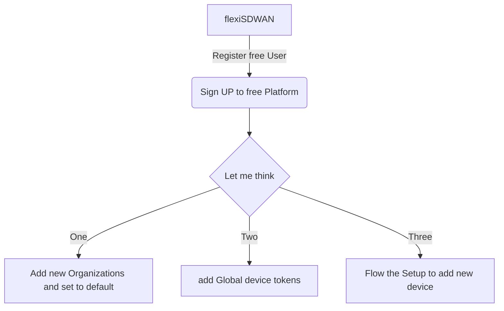

# Architecture

# Create Account

- [ ] ###### Sign in https://manage.xiangyundns.cn/create-account

- [ ] ###### Receive Email to active Account

- [ ] ###### sign up the account

# Create your network in few simple steps

- [ ] #### On your router device
  
  - [ ] ###### Install the latest flexiWAN images for your hardware device, virtual appliance or supported cloud providers as explained in the [installation guide](https://docs.flexiwan.com/installation/getting-installing.html)

- [ ] #### On your management account
  
  - [ ] ###### Create your organization token in the Inventory → Tokens menu
  
  - [ ] ###### Copy your organization token into the device file:   `/etc/flexiwan/agent/token.txt`

- [ ] #### Approve the Devices
  
  - [ ] ###### You should see your device in the Inventory → Devices menu
  
  - [ ] ###### Click on the device name, approve it and verify the interface configuration
  
  - [ ] ###### Click on the "Update Device" button and you're ready to go

- [ ] #### ADD the different type of tunnels
  
  - [ ] ###### After your device is approved and connected
  
  - [ ] ###### you can start it and create secure tunnels to your other sites

# Have fun! Enjoy the SDWAN

Any questions to Email to bytebit@foxmail.com
